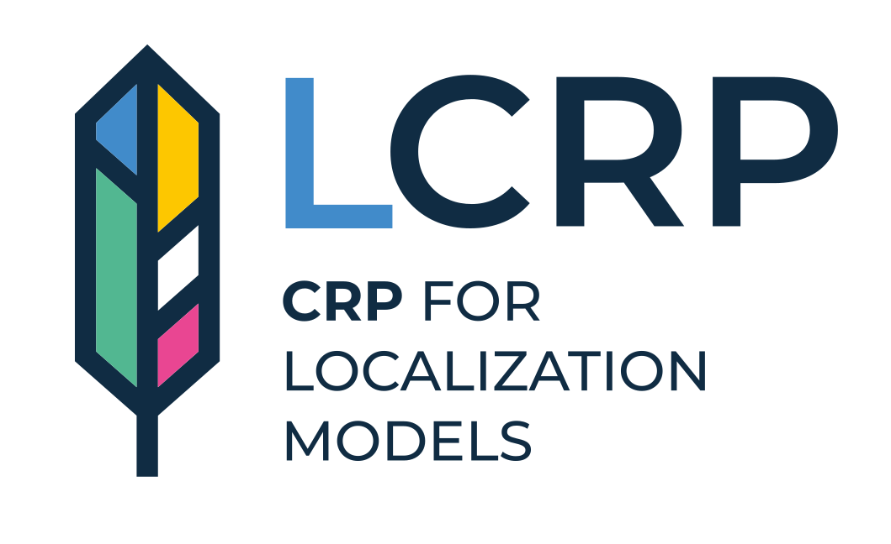
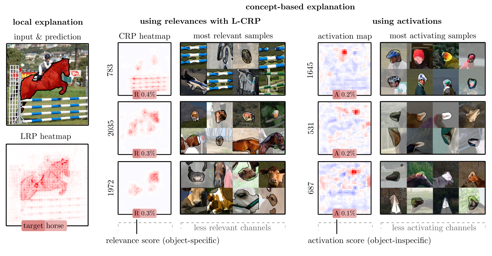
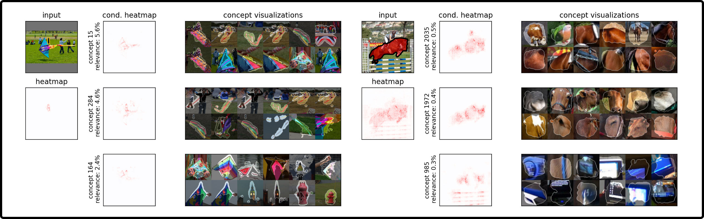
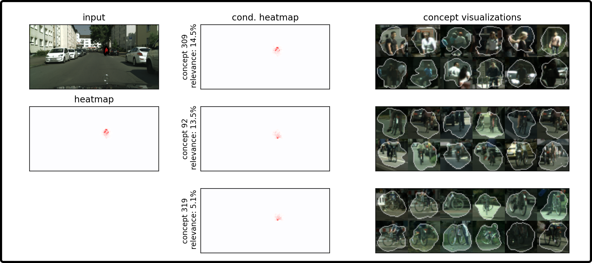

<div align="center">

<h1>L-CRP: Concept Relevance Propagation for Localization Models</h1>
<p>
Rendering Local Concept-based Explanations in PyTorch</p> 
</div>

[](https://openaccess.thecvf.com/content/CVPR2023W/SAIAD/papers/Dreyer_Revealing_Hidden_Context_Bias_in_Segmentation_and_Object_Detection_Through_CVPRW_2023_paper.pdf) 

## Description 
 Applying traditional post-hoc attribution methods to segmentation or object detection predictors offers only limited insights,
 as the obtained feature attribution maps at input level typically resemble the models’ predicted segmentation mask or bounding box.
 In this work, we address the need for more informative explanations for these predictors by proposing
 the post-hoc eXplainable Artificial Intelligence method **L-CRP** to
 **generate explanations that automatically identify and visualize relevant concepts** learned, recognized and used by the model
 during inference as well as precisely locate them in input space.
 Our method therefore goes beyond singular input-level attribution maps and, 
 as an approach based on the Concept Relevance Propagation technique,
 is efficiently applicable to state-of-the-art black-box architectures. 
 
<div align="center">

<p style="width: 700px;">
L-CRP (center) goes beyond traditional local heatmaps (left) or latent activation analysis (right), 
by communicating which latent concepts contributed to a particular detection, to what degree in terms of relevance (R)
and where concepts are precisely located in input space.</p>
</div>

Please feel free to cite our work, if used in your research: 
 
```bibtex 
@inproceedings{dreyer2023revealing,
  title={Revealing Hidden Context Bias in Segmentation and Object Detection through Concept-specific Explanations},
  author={Dreyer, Maximilian and Achtibat, Reduan and Wiegand, Thomas and Samek, Wojciech and Lapuschkin, Sebastian},
  booktitle={Proceedings of the IEEE/CVF Conference on Computer Vision and Pattern Recognition Workshops},
  pages={3828--3838},
  year={2023}
}
```

### Currently supported models:

<table>
  <thead>
    <tr>
      <th>Segmentation</th>
      <th>Object Detection</th>
    </tr>
  </thead>
  <tbody style="text-align: center">
    <tr>
      <td>UNet (CityScapes)</td>
      <td>YOLOv5m (COCO 2017)</td>
    </tr>
    <tr>
      <td>DeepLabV3+ (VOC 2012)</td>
      <td>YOLOv6s (COCO 2017)</td>
    </tr>
    <tr>
      <td></td>
      <td>SSD (COCO 2014)</td>
    </tr>
  </tbody>
</table>


## Table of Contents

- [Installation](#installation)
- [Examples](#examples)
- [How-To](#how-to)
  - [1) Rendering of L-CRP explanations](#1-rendering-of-l-crp-explanations)
- [Paper Reproducibility](#paper-reproducibility)


# Installation:

### 1) install requirements (tested with Python 3.8.10)
```
pip install -r requirements.txt
```

### 2) Datasets
Download datasets via public available links and setup paths in corresponding dataset python files in /datasets.
1. [CityScapes](https://www.cityscapes-dataset.com)
2. [MS COCO 2017](https://cocodataset.org)
3. [VOC 2012](http://host.robots.ox.ac.uk/pascal/VOC/voc2012/)
4. [MS COCO 2014](https://cocodataset.org)

### 3) Models
The YOLOv5, YOLOv6, SSD and DeepLabV3+ models are taken from the following repositories and adapted to our needs.
1. [DeepLabV3+ (ResNet50)](https://github.com/VainF/DeepLabV3Plus-Pytorch)
2. [YOLOv5m](https://github.com/ultralytics/yolov5)
3. [YOLOv6s](https://github.com/meituan/YOLOv6)
4. [UNet](https://github.com/qubvel/segmentation_models.pytorch)
5. [SSD (VGG-16)](https://github.com/lufficc/SSD)
 
All used model checkpoints can be downloaded [**here**](https://datacloud.hhi.fraunhofer.de/s/2wK2ARSWoSSdJ6p).
Please save checkpoints in the `models/checkpoints` directory. 

# Examples

<div align="center">

<p style="width: 700px;">
L-CRP explanations of the YOLOv6 (left) and DeepLabV3+ (right).
It is apparent that the models use background features, such as the kite for the detection of a person (left)
or the horizontal bar (blue color concept) for the segmentation of the horse (right).
</p>
</div> 

<div align="center">

<p style="width: 700px;">
L-CRP explanation of the UNet model trained on the CityScapes dataset with respect to the segmentation of the 'rider' class.
The explanation indicates, that the UNet uses background features, such as the bicycle for prediction.
</p>
</div>

# How-To:

## 1) Rendering of L-CRP explanations

In order to render an L-CRP explanation, we need to first perform a glocal preprocessing step.
The glocal preprocessing step is performed via the `run_glocal_analysis.sh` script in the `scripts` directory.

Note, that this step can be skipped if you want to render explanations for the provided checkpoints. 
All L-CRP preprocessing files can be downloaded [**here**](https://datacloud.hhi.fraunhofer.de/s/jXr9C4nc3QzdgDK) and should be saved in the `outputs/crp` directory.

After the glocal preprocessing step, we can render L-CRP explanations via the `experiments/plot_crp_explanation.py` script.


# Paper Reproducibility

To reproduce all the results of our paper, please adhere to the submitted code for the CVPR 2023 workshop, which is provided 
[**here**](https://datacloud.hhi.fraunhofer.de/s/GqyC8tpe3zXMzXX).

This repository is adapted from the submitted code to be more user-friendly,
and contains the exact same model checkpoints and datasets.


